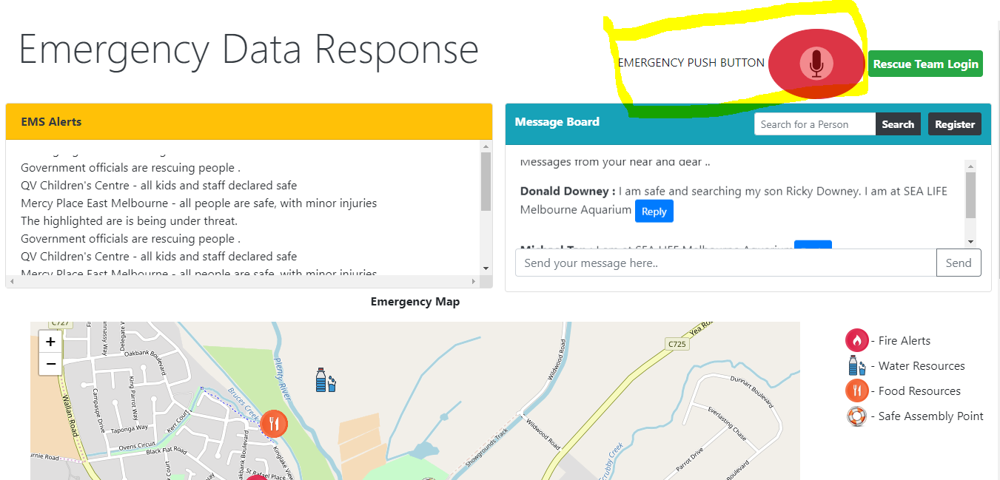
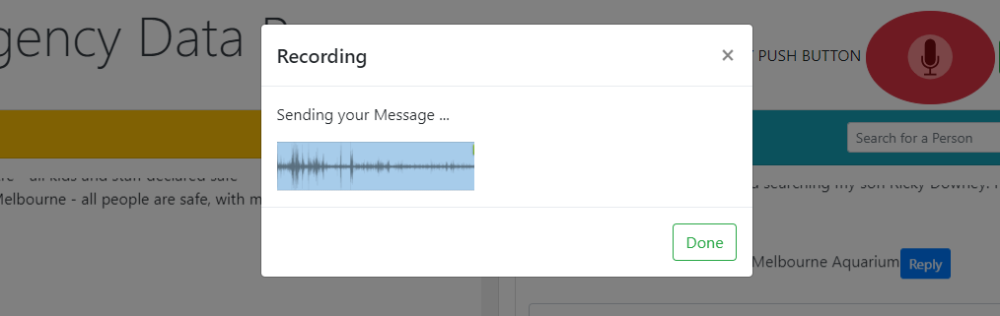
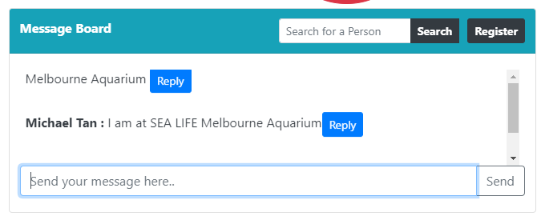
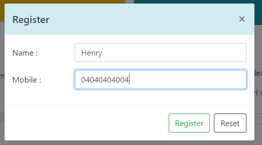
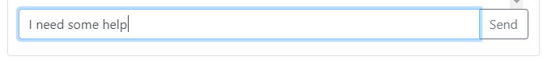
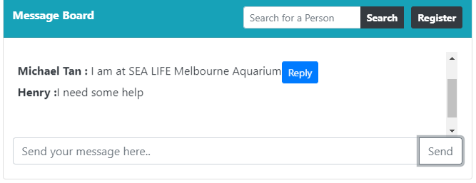
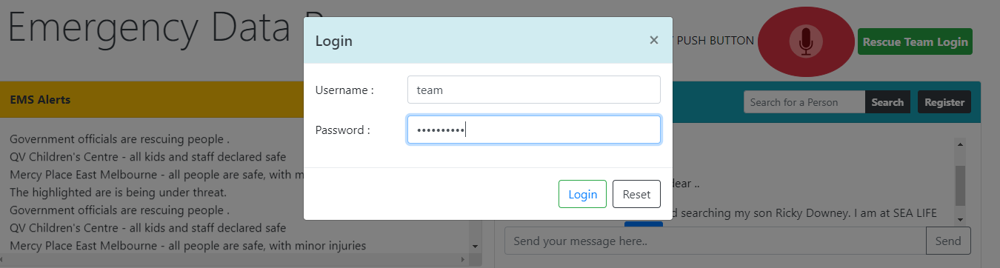
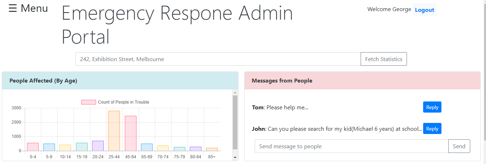
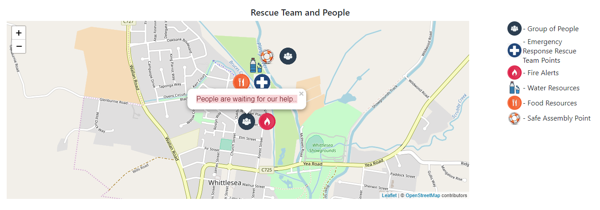
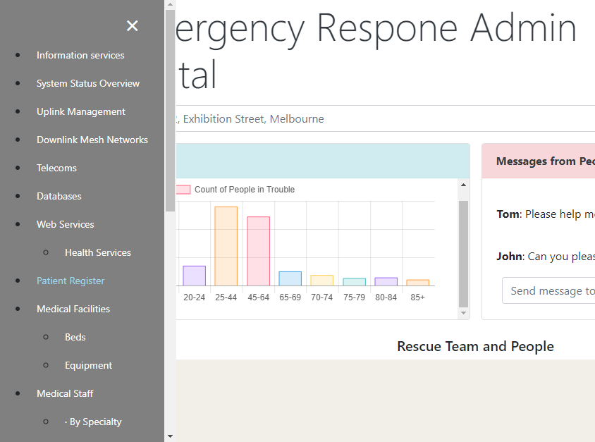

# TechPreppers
### Download git project 
### Open index.html

## Overview

## Video

## Emergency Data Response – Manual
### Index.html - People Home Page
1. Portal used by the people in Trouble. This will be loaded from the webserver which is deployed at the premises of the emergency areas.

2. People use Push button to send the emergency messages to the Team.

3. Messages Board – Use to see and send the messages to near and dear located at that rescue center.

4. People can register with the name and mobile number, so that the rescue team has the details.

5. Maps and Wiki links loaded from government local spatial data and EMS rescue data

### Team Portal
1. Team Login – Used to login by the rescue team and update the data, then and there.

2. Admin Portal, where the government and Rescue officers can see the affected area and details of the people and their health from the government data.

3. Map where the people and rescue team are in place.

4. Menu Links where there many more options to go…

